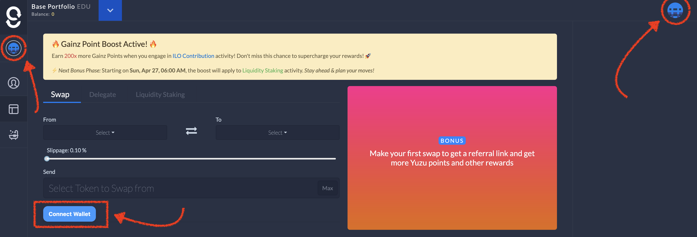

# Quick Start

Welcome to **GainzSwap**, your entry point into the decentralised finance (DeFi) ecosystem on **EDU Chain**. This guide walks you through everything you need to get started, from setting up your wallet to making your first swap, earning through referrals, and more.

***

#### 🧰 What You’ll Need

Before you begin, here are the essentials:

* **A Crypto Wallet**:\
  Install [MetaMask](https://metamask.io/), [Trust Wallet](https://trustwallet.com/), or any compatible Web3 wallet.
* **EDU Chain Network**:\
  GainzSwap runs on EDU Chain. You’ll need to connect your wallet to this network.\
  &#xNAN;_&#x50;ro tip: If it's not automatically detected, you'll be prompted to add it._
* **Some $EDU Tokens**:\
  These are required for swaps, staking, and paying transaction fees. You can get started by claiming [free tokens via our faucet](../mainnet-faucet.md) (details below).

***

#### 🔗 Connect Your Wallet

1. Visit [**gainzswap.xyz**](https://gainzswap.xyz)
2. Click **“Connect Wallet”,** following the screenshot below.

1. Approve the connection request in your wallet popup.
2. Ensure you’re on the **EDU Chain** network.

***

#### 💱 Swap Tokens

GainzSwap allows you to easily swap between any supported tokens.

**Steps to swap:**

1. Navigate to the **Swap** section.
2. Choose the token you want to swap **from** and the one you want to receive.
3. Enter the amount.
4. Review slippage and expected output.
5. Click **Swap Now**, then confirm the transaction in your wallet.

_💡 Fees are minimal, and swaps are processed instantly thanks to EDU Chain’s speed._

***

#### 💧 Stake Liquidity

Provide liquidity to earn a share of trading fees and potential rewards.

**Steps to add liquidity:**

1. Go to the **Liquidity Staking** tab.
2. Select a token pair (e.g., $EDU / $GAINZ).
3. Enter the amounts for both tokens.
4. Approve and confirm the transaction.

_💡 Liquidity providers earn GTokens representing their pool share and governance rights. These can be optionally locked or withdrawn anytime._

***

#### 🧑‍🏫 Delegate $EDU

This is our extended solution to allow staking $EDU while support liquidity growth on GainzSwap.

**Steps to delegate:**

1. Visit the **Delegate $EDU** tab.
2. Enter the amount of $EDU to delegate.
3. Click **Delegate**, then approve the transaction.

_💡 You’ll receive Gainz points every second based on your delegation, which can be eventually redeemed for $EDU tokens._

***

#### 🧴 Claim Free Tokens (Faucet)

To help you get started, we offer a **mainnet faucet**.

**How to claim:**

1. Go to the **Faucet** page.
2. Click **“Claim”** and confirm the transaction.

💡 Want more tokens? Share your **referral link**! When someone claims using your link, you both receive bonus faucet tokens.

_**Note:** Your wallet address must be whitelisted on the telegram group_

***

#### 📣 Refer and Earn

Invite others and earn rewards every time they interact with GainzSwap.

**How it works:**

1. Make your first swap on GainzSwap
2. Copy your generated on-chain referral link.
3. Share it with friends, communities, and on social media.
4. Earn referral rewards when they perform actions like swapping, staking or claiming the faucet.

_💡 The more active your referrals, the higher your rewards. You get rewards even from the referrals of your referral._

***

#### 🚀 Launchpads and ILOs

Participate in new token launches through **Initial Liquidity Offerings (ILO)**.

* Discover promising new projects
* Commit $EDU or other tokens during ILO rounds
* Receive project tokens and GTokens at launch

***

#### ✅ You’re Ready!

Now that you’re all set, you can start:

* Swapping tokens
* Earning rewards by providing liquidity
* Delegating $EDU to help boost liquidity&#x20;
* Growing your wallet through referrals

Be sure to check other parts of the documentation for advanced features and FAQs.
