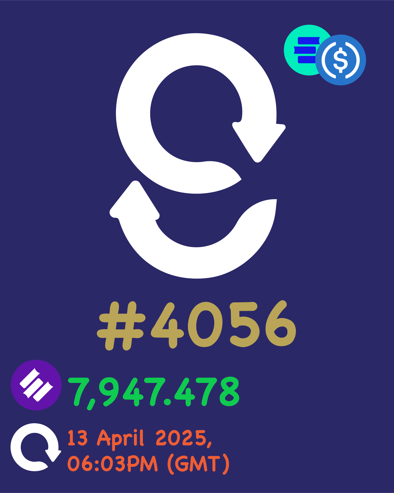

# GToken

**GToken** is the core **staking and governance token** of the GainzSwap ecosystem. It is not minted directly but rather **derived** from locking LP tokens in the protocol’s governance staking contract. GToken holders represent the **most committed liquidity providers**, as they lock capital and earn long-term influence — they are the true Gainerz.

<figure><figcaption>
GToken Sample
</figcaption></figure>

***

## How GToken Works

| Feature               | Details                                                                                               |
| --------------------- | ----------------------------------------------------------------------------------------------------- |
| **Minting**           | GToken is **created by optionally locking LP tokens** in the Governance contract                      |
| **Burning**           | GToken is **burned** when LP tokens are unstaked                                                      |
| **Semi-Fungible**     | GToken is **transferable,** and can be merged or split                                                |
| **Governance Rights** | Holders **vote on proposals**, including token listings and upgrades                                  |
| **Staking Rewards**   | GToken holders receive **$Gainz staking rewards**, **throttled** by $dEDU supply                      |
| **Vote Weight**       | The amount and number of epochs locked of GToken a user holds directly **affects their voting power** |

***

## Entry & Exit Governance Conditions

| Action    | Requirement                                              | Result                                                                     |
| --------- | -------------------------------------------------------- | -------------------------------------------------------------------------- |
| **Enter** | Stake liquidity by optionally locking LP tokens          | Receive GToken encoded with appropriate attributes                         |
| **Exit**  | Unstake liquidity by burning GToken, and hence LP tokens | Retrieve corresponding LP pair tokens, with upto 30% loss if early unstake |

***

## Role in Governance

* **Proposal Access:**\
  Only users holding GToken, with specific attributes, can propose new pair listings or protocol upgrades.
* **Voting Power:**\
  GToken holders cast votes weighted by their GToken balances and epochs locked. For sensitive proposals (e.g., protocol fees, council elections), **GToken** is the exclusive mechanism of decision-making.
* **Incentive Alignment:**\
  Since GToken requires LP locking, it ensures governance participants are **economically aligned** with the platform’s long-term success.

***

## Staking Rewards Emission

* Rewards come from the **Staking Rewards** pool (9.55 M $Gainz).
* However, actual emission is **dynamically throttled** based on the **$dEDU circulating supply** (delegated governance participation).
* This creates a three-way balance:
  * LP Token Holders → stake and mint GToken
  * GToken Holders → earn rewards, vote
  * $dEDU Holders → throttle how fast rewards flow

This system ensures that not just capital (via LP tokens), but also **community trust and reputation** (via delegation) plays a role in reward distribution.

####
