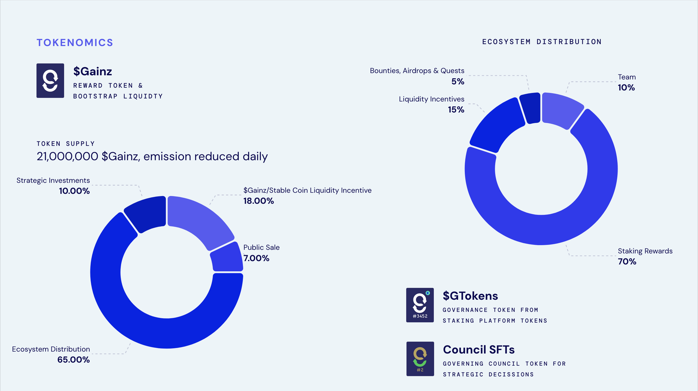

# $GAINZ Token

$Gainz is the **native reward and bootstrap liquidity** token for GainzSwap — a critical component in aligning incentives, facilitating governance, and ensuring sustainable growth within the EDU Chain ecosystem. The total supply is **21,000,000 $Gainz**, with a carefully designed emission schedule that decreases over time.

## Overview

* **Token Name:** $Gainz
* **Total Supply:** 21,000,000
* **Emission Model:** Deflationary, distributed primarily to liquidity stakers (via GToken).
*   **Key Utilities:**

    * Protocol Fees Payment (buy & burn mechanism)
    * Governance rights (when staked via liquidity pools / GToken)
    * Security deposit for projects ILOs (via GToken)
    * Incentivizing liquidity, user engagement, bounties, and quests

## Distribution Breakdown

<figure><figcaption>
$Gainz Distribution
</figcaption></figure>

### Primary Allocation of 21 Million $Gainz

The total mint of **21 000 000 $Gainz** is split into four main buckets. The **Ecosystem Distribution** (65%) is held in the $Gainz token contract and programmatically allocated according to the rules below.

<table><thead><tr><th width="219.5">Category</th><th width="100" align="right">% of Total</th><th width="150.5" align="right">Amount (Tokens)</th><th>Notes</th></tr></thead><tbody><tr><td><strong>Ecosystem Distribution</strong></td><td align="right">65%</td><td align="right">13 650 000</td><td>Held in‑contract and emitted per protocol rules</td></tr><tr><td><strong>Liquidity Incentive</strong></td><td align="right">18%</td><td align="right">3 780 000</td><td>Stablecoin or $EDU pool(s) to bootstrap new and critical pairs with $Gainz token</td></tr><tr><td><strong>Public Sale</strong></td><td align="right">7%</td><td align="right">1 470 000</td><td>Strategic community sale for Council SFTs (council members)</td></tr><tr><td><strong>Strategic Investments</strong></td><td align="right">10%</td><td align="right">2 100 000</td><td>Partnerships, grants, ecosystem expansion</td></tr><tr><td><strong>Protocol &#x26; Core Team</strong></td><td align="right">—</td><td align="right"><em>(see Ecosystem)</em></td><td>Allocated from Ecosystem Distribution through a decay function</td></tr></tbody></table>

### Ecosystem Distribution (13 650 000 $Gainz)

This 65% tranche is controlled by the $Gainz token contract and dispensed automatically through a decay function:

<table><thead><tr><th width="186">Sub‑Category</th><th width="125" align="right">% of Ecosystem</th><th width="137" align="right">Amount (Tokens)</th><th>Mechanism</th></tr></thead><tbody><tr><td><strong>Staking Rewards</strong></td><td align="right">70%</td><td align="right">9 555 000</td><td>Emitted to GToken holders, <strong>throttled</strong> by real‑time $dEDU supply (see below)</td></tr><tr><td><strong>Liquidity Incentives</strong></td><td align="right">15%</td><td align="right">2 047 500</td><td>Bootstrap liquidity for external projects’ pools and select pair incentives</td></tr><tr><td><strong>Bounties, Airdrops &#x26; Quests</strong></td><td align="right">5%</td><td align="right">682 500</td><td>Community engagement, marketing campaigns, and special event rewards</td></tr><tr><td><strong>Team &#x26; Protocol</strong></td><td align="right">10%</td><td align="right">1 365 000</td><td>Emitted following the decay function.</td></tr></tbody></table>

### **Staking Rewards Throttled by $dEDU Supply**

* The **Staking Rewards** pool (9 555 000 $Gainz) is distributed to GToken holders (liquidity stakers).
* However, the **actual emission rate** at any given time is **dependent on the circulating supply of $dEDU**, as enforced by the Governance contract via the $dEDU contract.
* **More $dEDU → higher staking emissions**; **less $dEDU → lower emissions**, ensuring that rewards scale with community participation and liquidity growth.

### How It Works in Practice

1. **Upfront Allocations**\
   All allocations, except **Ecosystem Distribution**, are distributed and held in separate addresses pending when they will be used for their purpose. &#x20;
2. **Ecosystem Distribution Lockup**\
   All 13.65 M tokens reside in the $Gainz contract. They are not released upfront but emitted per the above schedule.
3. **Automated Emissions**
   * **Staking rewards** flow to GToken balances each second, dynamically adjusted by the on‑chain $dEDU supply.
   * **Liquidity incentives**, **bounties**, and **team** are released based on the decay function following certain milestone triggers.
4. **Supply Cap & Deflation**\
   Once the 21 M cap is reached, no new $Gainz can be emitted. Meanwhile, protocol fees are used to **supply the decay function**, creating a sustainable ecosystem tokens distribution.

This two‑tiered distribution model aligns long‑term value accrual with active community participation, rewarding those who stake, delegate (via $dEDU), and contribute to GainzSwap’s liquidity and governance.

## Utility & Governance

### Governance

* **Staking $Gainz via GToken:**\
  Liquidity providers who stake their LP tokens receive **GToken**, which entitles them to governance rights. Because $Gainz is distributed to GToken holders, it indirectly grants greater say in protocol proposals to those most invested in the ecosystem.
* **ILO Listings**\
  Only GTokens having $Gainz liquidity pools can be used as security deposits for creating ILO listings. Though all tokens listed on GainzSwap becomes governance tokens through GToken, only $Gainz will have the power to influence new token listings.
* **Protocol Upgrades & Decisions:**\
  Future on-chain voting mechanisms may use staked $Gainz (or GToken) balances to determine voting power, enabling a **community-centric decision process**.

### Protocol Fees & Buy-Burn

* **Swap Fee Payments in $Gainz:**\
  A portion (or all) of the fees collected from trading on GainzSwap are used to **purchase and burn $Gainz**, creating a **deflationary pressure** that benefits long-term holders.
* **Long-Term Sustainability:**\
  This buy-and-burn model aligns platform growth with token value, reducing sell pressure and fostering a more balanced supply-demand dynamic.

### Incentives & Rewards

* **Liquidity Mining:**\
  Stakers of GToken (which represents locked LP tokens) receive $Gainz emissions proportionate to their share.
* **Bootstrap Liquidity**\
  To foster ecosystem wide growth, GainzSwap will support projects, through governance, with liquidity allocation from token distribution (see Ecosystem Distribution above)
* **Bounties, Airdrops, & Quests:**\
  A percentage of $Gainz is reserved for marketing, development bounties, and quest-based user engagement. This encourages active participation and user-driven innovation.

***

## Putting It All Together

$Gainz is engineered to:

1. **Reward Positive Action:** Users who contribute liquidity or engage with the protocol can earn $Gainz, creating a virtuous cycle of expansion.
2. **Empower Governance:** $Gainz fosters a community-led environment where those contributing the most hold the most influence.
3. **Protect Long-Term Value:** Through daily emission reductions and a robust buy-and-burn mechanism, the protocol safeguards against uncontrolled inflation.
4. **Expand the EDU Chain Ecosystem:** A portion of $Gainz is dedicated to partnerships, bounties, and quests, driving growth beyond just GainzSwap.

Whether you’re a liquidity provider, a project partner, or simply a trader intrigued by the potential of DeFi on the EDU Chain ecosystem, $Gainz offers both **tangible incentives** and **long-term strategic value**. By aligning rewards with contributions, $Gainz ensures that GainzSwap’s community and token holders thrive together — laying a strong foundation for the future of decentralised finance on EDU Chain.
